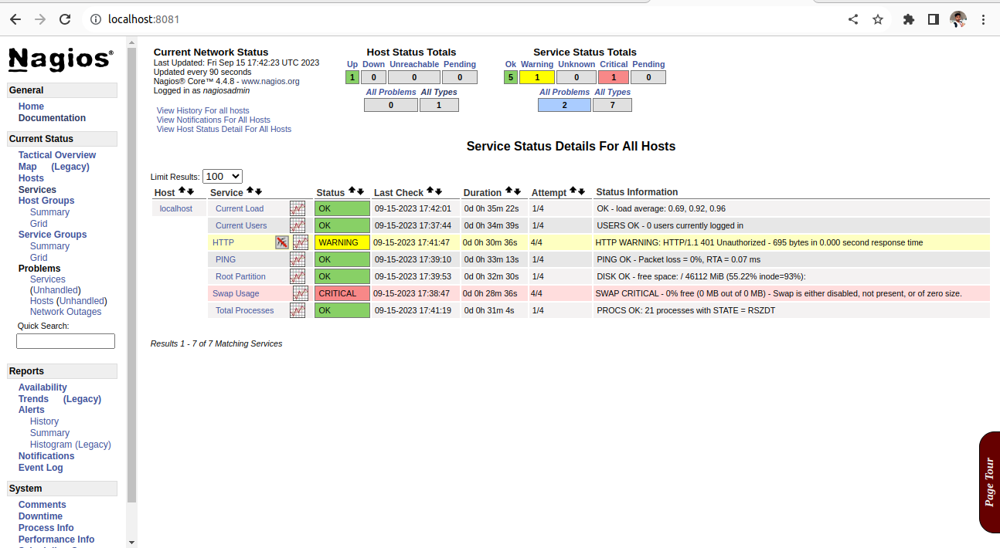

<p style="color: blue; font-weight: bold; text-align: center; font-size: 55px;">Nagios</p>

<p>Nagios is an open-source network monitoring tool that helps monitor various aspects of your IT infrastructure. With Nagios, your network, servers, applications, and services can be tracked in real-time, allowing you to identify and resolve problems in advance.</p>

**Some of the major services of Nagios:**

**1.Host Monitoring:** Nagios can monitor every single device on your network, such as servers, routers, switches, and firewalls. You will know if any device is offline or having any issue.

**2.Service Monitoring:** Nagios monitors your servers and services such as HTTP, FTP, DNS, SSH, SMTP, and others. You can detect service downtime and performance issues.

**3.Event Logging:** Nagios logs events that happen in your network. You find out when and why something happened.

**4.Alerts:** You are notified via email, SMS, or other notification methods when an issue or anomaly is detected. You can take immediate action on this.

**5.Performance Monitoring:** Nagios tracks the performance metrics of your servers and applications, such as CPU usage, memory usage, disk space, and network traffic.

**6.Plugin Support:** You can use plugins for the flexibility of Nagios. You can create custom plugins or use community-made plugins.

**7.Graphical Reporting:** Nagios displays your monitoring data in graphical reports, which you can understand trends and patterns.

**8.Scheduled Downtime:** You can set scheduled downtime for this, which you can mute the alerts at the time of maintenance windows.

**9.Remote Monitoring:** Nagios remote locations can also be monitored, which is useful if you have a distributed infrastructure.

**10.Security Monitoring:** With Nagios you can also detect security vulnerabilities and attacks, such as unauthorised access attempts.


## **Screenshot:**



## **Installation:**

**Update System Packages**

  
~~~
sudo apt update
~~~

```
sudo apy upgrade
```

**Install Podman**
~~~
sudo apt install podman
~~~

**Create a Directory for Nagios**

~~~
mkdir nagios
~~~
~~~
cd nagios/
~~~
~~~
mkdir config
~~~
**Pull the Nagios Container Image**
~~~
podman pull docker.io/jasonrivers/nagios:latest
~~~
**Create a Nagios Podman Container**
~~~
podman run -d   --name nagios   -p 8081:80 --cap-add=NET_RAW  -v /home/keen/nagios/config:/opt/nagios/etc   docker.io/jasonrivers/nagios:latest
~~~
~~~
podman exec -it nagios bash
~~~
~~~
ls
~~~
~~~
cd opt/
~~~
~~~
cd nagios
~~~
~~~
cd /etc
~~~
~~~
cd objects/
~~~

**Run it on Web Browser :** http://localhost:8081

 **Username:** nagiosadmin <br>
 **Password:** nagios


