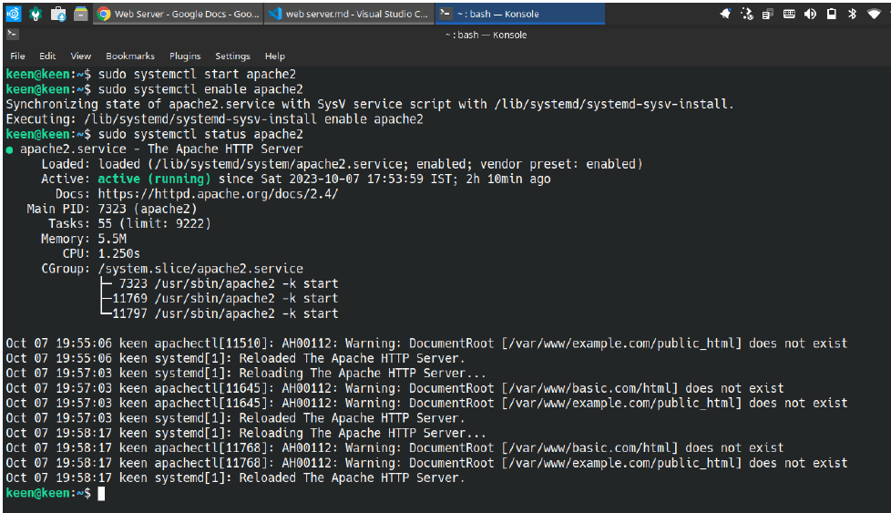

Web Server

About:

A web server is software or computer program that stores and delivers web content such as websites and web pages when people access them through their web browsers, allowing them to view and interact with information online.  

It is necessary to host websites on the Internet.

**Here's why a web server is necessary for hosting websites on Ubuntu, or any other operating system:**

**1. Request Handling:** Web servers are designed to handle HTTP (Hypertext Transfer Protocol) requests from clients, such as web browsers. When a user enters a website's URL or clicks a link, their browser sends an HTTP request to the web server hosting that website. The web server processes this request and sends back the requested web page or resource.

**2. Content Storage:** A web server stores all the files and data that make up a website, including HTML documents, images, videos, stylesheets, scripts, and more. When a user requests a web page, the server retrieves and delivers these files to the user's browser.

**4. Security:** Web servers play a crucial role in security by implementing various security measures, such as access controls, encryption (HTTPS), and firewalls, to protect websites from unauthorized access, data breaches, and other security threats.

**5. Load Balancing:**  For high-traffic websites, multiple web servers can be used behind a load balancer to distribute incoming requests evenly. This ensures that the website can handle a large number of users simultaneously without becoming slow or unresponsive.

**6. Hosting Multiple Websites:** A single web server can host multiple websites, each with its own domain name and content. Server configuration and virtual hosting allow multiple websites to share the same server resources while remaining separate from each other.

Install the Apache Web Server (Ubuntu):

**1. Update Package Repository**

~~~
sudo apt update
~~~
~~~
sudo apt upgrade
~~~

**2. Install Web Server**
~~~
sudo apt install apache2
~~~

  

**3. Start the Web Server**
~~~
sudo systemctl start apache2
~~~
~~~
sudo systemctl enable apache2
~~~
~~~
sudo systemctl status apache2
~~~

Purpose of the Apache default web root directory:

The Apache default web root directory on Ubuntu, also known as the DocumentRoot, is the directory where the Apache web server looks for files to serve when a client (such as a web browser) requests a web page. 
This directory is where you typically place your website's files, including HTML, CSS, JavaScript, images, and other assets.

**The default location of the Apache web root directory:**
~~~
/var/www/html
~~~

**You can change the web root directory in Apache by modifying the Apache configuration files:**

**1. Open Configuration File** 
~~~
sudo vim /etc/apache2/apache2.conf
~~~
~~~
sudo apt install vim
~~~

**2. Restart Web Server**
~~~
sudo systemctl restart apache2
~~~

Configuring Virtual Hosts:

Configuring Virtual Hosts in Apache on Ubuntu is significant because it allows you to host multiple websites or web applications on a single server.
**Set up a basic Virtual Host on Apache:**

**1. Create a directory for your website:**
~~~
sudo mkdir -p /var/www/basic/html
~~~

     
**2. Assign ownership:**
~~~
sudo chown -R www-data:www-data /var/www/basic/html/
~~~
    
**3. Create an HTML file:**
~~~
sudo vim /var/www/basic/html/index.html
~~~

**Paste Below Code on it**

~~~
<!DOCTYPE html>
<html>
<head>
    <title>Welcome To Noida</title>
</head>
<body>
    <h1>Hello Deepak</h1>
    
NOida Keen and Able

</body>
</html>
~~~
    
**4. Create a Virtual Host Configuration File:**
~~~
sudo vim /etc/apache2/sites-available/basic.conf
~~~

**Copy & Paste Below Code on it**

~~~
<VirtualHost *:80>
   ServerAdmin webmaster@example.com
   ServerName deepak.com
   DocumentRoot /var/www/basic/html
   ErrorLog ${APACHE_LOG_DIR}/error.log
   CustomLog ${APACHE_LOG_DIR}/access.log combined
</VirtualHost>
~~~
  
  

**Where as:**

  **ServerAdmin** webmaster@example.com   (or add your Email ID)  
 **ServerName deepak.com**             (yourDomainName for web) 
 **DocumentRoot** /var/www/basic/html    (for index.html file path)

**5. Enable the Virtual Host:**
~~~
sudo a2ensite basic.conf
~~~
   
**6. Reload Apache2:**
~~~
sudo systemctl reload apache2
~~~

**7. Update Hosts File (optional):**
~~~
sudo vim /etc/hosts
~~~

 

**Add This Code Under hosts file in host address:**
192.168.1.64 deepak.com

**Where as 192.168.1.64 is my System IP**  
**deepak.com**

**Run on Web Browser:** http://deepak.com/

 
